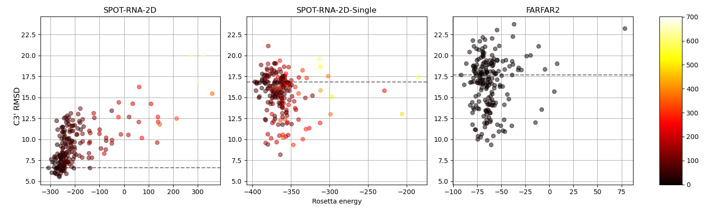
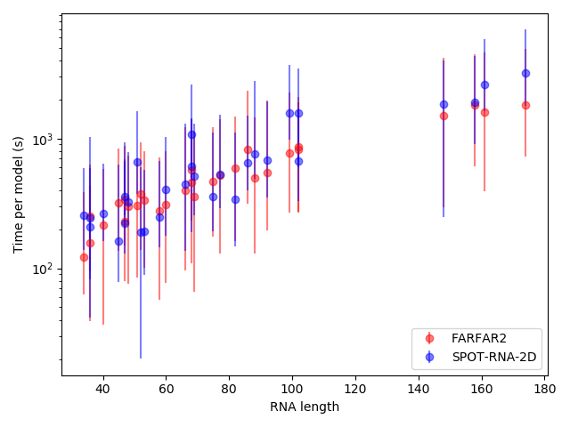

# SPOT-RNA-2D: 3D MODELLING

Pairwise residue constraints can be extracted from SPOT-RNA-2D predicted contact maps. These constraints can be used to bias the scoring of fragment assembly molecular modelling simulations and generate better quality 3D models. Models generated when preparing the manuscript can be [downloaded](https://servers.sparks-lab.org/downloads/SPOT-RNA-2D-silent.tar.gz) as Rosetta silent files from the sparks-lab web site.



## Dependencies
1. Install Rosetta from [here](https://new.rosettacommons.org/demos/latest/tutorials/install_build/install_build).
    Note:  2021.16.61629 used to generate results in manuscript.
2. Clone [rna_benchmark](https://github.com/DasLab/rna_benchmark) repository

## Prepare environments
```
export ROSETTA=/PATH/TO/rosetta_src_2021.16.61629_bundle/
export RNA_TOOLS=$ROSETTA/main/tools/rna_tools/
export PATH=$RNA_TOOLS/bin/:$PATH
export PYTHONPATH=$PYTHONPATH:$RNA_TOOLS/bin/

conda activate venv_spotrna_2d
conda install biopython
conda deactivate

conda create -n py2_spot python=2.7 numpy
conda activate py2_spot
```

## Generate Inputs
```
cd runs/FARFAR2
python /PATH/TO/rna_benchmark/scripts/python/benchmark_util/setup_stepwise_benchmark.py --farfar ../../TS2.txt

cd ../SPOT-RNA-2D/
python /PATH/TO/rna_benchmark/scripts/python/benchmark_util/setup_stepwise_benchmark.py --farfar ../../TS2.txt
bash ../../util/prep-spot.sh ../../TS2_ids 0.3

cd ../SPOT-RNA-2D-Single/
python /PATH/TO/rna_benchmark/scripts/python/benchmark_util/setup_stepwise_benchmark.py --farfar ../../TS2.txt 
bash ../../util/prep-spot.sh ../../TS2_ids 0.4
```

## Generate Models
```
cd 1s03_A
bash all_commands.sh
```
Note: Computation time to generate a single model may be slow - particularly for long RNA. It is preferable to submit jobs to a HPC using the provided qsub_files.

